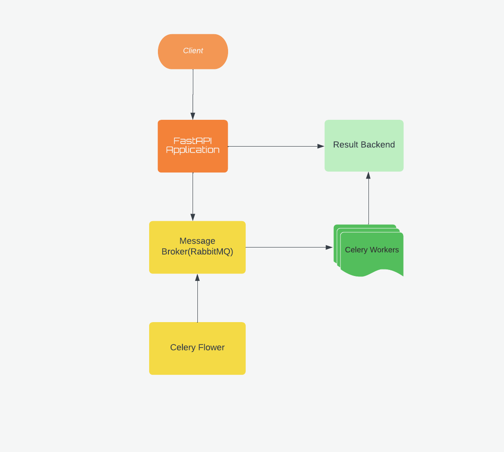
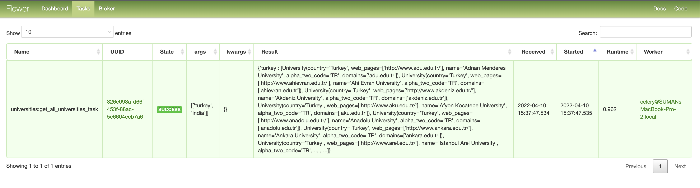
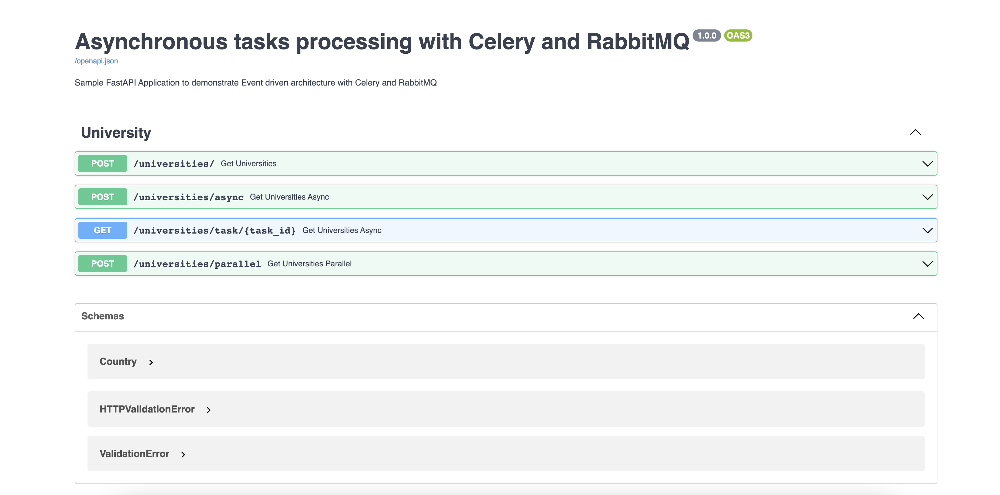

## Sample [FastAPI](https://fastapi.tiangolo.com/) Application to demonstrate Async architecture with [Celery](https://docs.celeryproject.org/), [RabbitMQ](https://www.rabbitmq.com/) and [Flower](https://flower.readthedocs.io/en/latest/)


Sample application utilizing FastAPI, Celery with RabbitMQ for task queue. RabbitMQ is also used as Celery backend and optional flower for monitoring the Celery tasks.

### FastAPI

FastAPI is a modern, fast (high-performance), web framework for building APIs with Python 3.6+ based on standard Python type hints.

The key features are:

**Fast**: Very high performance, on par with NodeJS and Go (thanks to [Starlette](https://www.starlette.io/) and [Pydantic](https://pydantic-docs.helpmanual.io/)). One of the fastest Python frameworks available.

**Fast to code**: It allows for significant increases in development speed.

**Easy**: Designed to be easy to use and learn. Less time reading docs.
**Short**: Minimize code duplication. Multiple features from each parameter declaration. Fewer bugs.
**Robust**: Get production-ready code. With automatic interactive documentation.
**Standards-based**: It’s based on the open standards for APIs, [OpenAPI](https://github.com/OAI/OpenAPI-Specification) and [JSON Schema](https://json-schema.org/).

### Celery

[Celery](https://github.com/celery/celery) is a simple, flexible, and reliable distributed system to process vast amounts of messages, while providing operations with the tools required to maintain such a system.
It’s a task queue with focus on real-time processing, while also supporting task scheduling.
It also helps us to handle asynchronous tasks, which is vital for smooth user experiences. With this powerful combo of FastAPI and Celery, we will be able to do things like:

* Run machine learning models
* Send bulk emails
* Process images or PDFs
* Generate exports of user data
* Perform backups

### RabbitMQ

[RabbitMQ](https://www.rabbitmq.com/) is the most widely deployed open source message broker.

### Flower
[Flower](https://flower.readthedocs.io/en/latest/) is a real-time web application monitoring and administration tool for Celery.


### Architecture



### Setting up the VirtualEnv and install dependencies

Go inside the project folder and execute the below commands. We will use [Pipenv](https://pypi.org/project/pipenv/) to setup the VirtualEnv.

```
pipenv shell --python 3.9.2
pipenv install -r requirements.txt

```

Dependencies will be installed from the Pipfile. Python version 3.9.2 is used for this project.

### Prerequisite
1. Python 3.9.2
2. Pipenv packaging tool
3. RabbitMQ instance

### Run the Application

```
python main.py
```
Start the Celery process, navigate to the project directory in a new terminal, activate the virtual environment, and then run:
```
pipenv shell --python 3.9.2
pipenv install -r requirements.txt
celery -A main.celery worker --loglevel=info -Q universities,university --concurrency=3
```
Optionally we can monitor the tasks submitted to Celery. To start the Flower process, Navigate to the project directory in a new terminal, activate the virtual environment, and then run:
```
pipenv shell --python 3.9.2
pipenv install -r requirements.txt
celery -A main.celery flower --port=5555
```
Once the Flower starts we cann see the submitted tasks at <http://localhost:5555/tasks>.



This will start the application on port 9000 and Celery process will listen to the Queue universities,university

### Test the application

FastAPI also automatically generated fully interactive API documentation that we can use to interact with our API. 
We can visit http://127.0.0.1:9000/docs in our browser to see the interactive API documentation provided by [Swagger UI](https://github.com/swagger-api/swagger-ui):



The server will start at <http://localhost:9000/docs>.

Please check out the article for further details.
[Async Architecture with FastAPI, Celery, and RabbitMQ ](https://dassum.medium.com/async-architecture-with-fastapi-celery-and-rabbitmq-c7d029030377)


### References
* https://docs.celeryq.dev/en/stable/index.html
* https://flower.readthedocs.io/en/latest/
* https://stackoverflow.com/questions/21233089/how-to-use-the-shared-task-decorator-for-class-based-tasks
* http://ask.github.io/celery/userguide/groups.html#groups
